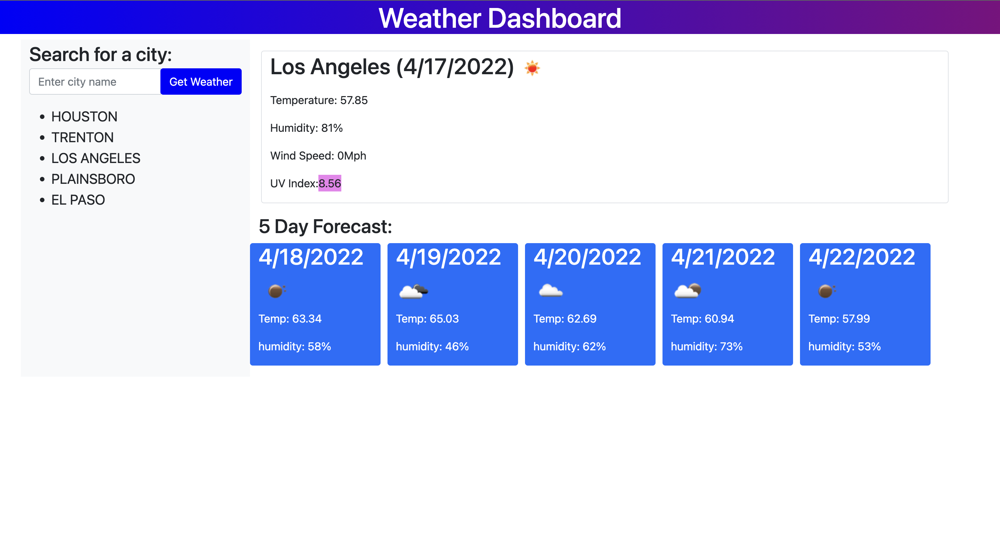

# weather-dashboard-challenge

## Purpose
A website that offers the weather outlook for multiple cities so that a trip can be planned accordingly.

## Built with
* HTML
* CSS
* JavaScript
* Bootstrap
* Moment.js
* Server-Side API - OpenWeather API 

## Website
https://browniecharl.github.io/weather-dashboard-challenge/

## Contribution
Made by Robert Velez